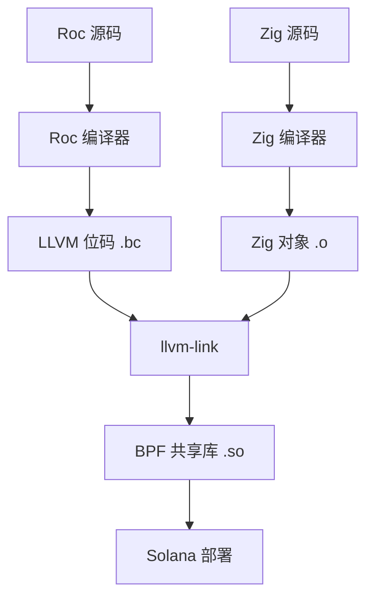

# 构建集成：Roc + Zig 用于 Solana

本文档解释了 Roc-Solana 平台如何将 Roc 编译与 Zig 的构建系统集成，以生成 Solana 兼容的 BPF 程序。

## 概述

构建 Roc 合约涉及三个主要步骤：

1. **Roc 编译**：将 Roc 源码编译为 LLVM 位码
2. **Zig 编译**：使用 SDK 集成编译 Zig 宿主代码
3. **链接**：将 Roc 和 Zig 组合成 BPF 共享库

## 先决条件

- Roc 编译器，具有 LLVM 后端支持
- Zig 0.15+，具有 BPF 目标支持
- LLVM 工具链用于位码操作

## 构建流程



## 详细过程

### 1. Roc 编译

将 Roc 平台和应用代码编译为 LLVM 位码：

```bash
# 编译平台定义
roc build --lib --emit-llvm-bc platform/main.roc -o platform.bc

# 编译应用合约
roc build --lib --emit-llvm-bc app.roc -o app.bc
```

**注意**：Roc 可能需要自定义目标支持 `bpfel-unknown-none`。如果不可用，先编译为通用 LLVM 并使用 `llc` 转换：

```bash
# 如果 Roc 不直接支持 BPF 目标
roc build --lib --emit-llvm-ir app.roc -o app.ll
llc -march=bpf -filetype=obj app.ll -o app.o
```

### 2. Zig 构建配置

`build.zig` 编排整个过程：

```zig
const std = @import("std");

pub fn build(b: *std.Build) void {
    const target = b.resolveTargetQuery(.{
        .cpu_arch = .bpfel,
        .os_tag = .freestanding,
    });

    // 1. 添加 Roc 生成的对象
    const roc_platform = b.addObjectFile(.{ .path = "platform.bc" });
    const roc_app = b.addObjectFile(.{ .path = "app.bc" });

    // 2. 编译 Zig 宿主
    const host = b.addObject(.{
        .name = "host",
        .root_source_file = .{ .path = "src/main.zig" },
        .target = target,
        .optimize = .ReleaseSmall,
    });

    // 3. 链接一切
    const lib = b.addSharedLibrary(.{
        .name = "roc_solana_contract",
        .target = target,
        .optimize = .ReleaseSmall,
    });

    lib.addObject(roc_platform);
    lib.addObject(roc_app);
    lib.linkLibrary(host);

    // 4. 安装步骤
    b.installArtifact(lib);
}
```

### 3. 内存布局考虑

**关键**：确保 Roc 和 Zig 对数据布局意见一致。

- **列表**：Roc 的 `List U8` = `{ ptr: *u8, len: usize, cap: usize }`
- **结构体**：内存布局必须在 Roc 和 Zig 之间匹配
- **字符串**：Roc 字符串是 UTF-8，确保正确处理

### 4. 入口点集成

Zig 宿主提供 Solana 入口点：

```zig
// src/main.zig
export fn entrypoint(input: [*]u8) u64 {
    // 使用 Zig SDK 解析输入
    const context = parseInput(input);

    // 转换为 Roc 格式
    const roc_context = zigToRocContext(context);

    // 调用 Roc 主函数
    const result = roc_mainForHost(roc_context);

    // 处理结果
    return if (result.is_ok) 0 else 1;
}
```

### 5. 效果处理

Roc 效果作为导出的 Zig 函数实现：

```zig
// src/effects.zig
export fn roc_fx_log(msg: RocStr) void {
    const slice = msg.asSlice();
    // 调用 Zig SDK
    solana.log(slice);
}

export fn roc_fx_transfer(from: *RocPubkey, to: *RocPubkey, amount: u64) void {
    // 将 Roc 类型转换为 Zig 类型
    const zig_from = rocPubkeyToZig(from);
    const zig_to = rocPubkeyToZig(to);

    // 使用 SDK 构建指令
    const instruction = solana.systemProgram.transfer(zig_from, zig_to, amount);

    // 调用
    solana.invokeInstruction(&instruction);
}
```

## 构建命令

### 开发构建

```bash
# 完整重建
zig build

# 仅编译，不链接
zig build -Dstep=compile

# 带调试信息
zig build -Doptimize=Debug
```

### 生产构建

```bash
# 优化发布构建
zig build -Doptimize=ReleaseFast

# 部署最小尺寸
zig build -Doptimize=ReleaseSmall
```

### 测试构建

```bash
# 运行单元测试
zig build test

# 运行集成测试（需要 Solana）
zig build test-integration
```

## 故障排除

### 常见问题

**"未定义符号: roc_mainForHost"**
- 确保 Roc 编译生成了正确的符号名称
- 检查 Roc 平台声明是否与 Zig extern 声明匹配

**"内存布局不匹配"**
- 验证 Roc 和 Zig 之间结构体字段顺序匹配
- 对 C ABI 兼容性使用 `extern struct`

**"LLVM 版本不匹配"**
- 确保 Roc 和 Zig 使用兼容的 LLVM 版本
- Solana 使用 LLVM 15+，检查 Roc 的 LLVM 版本

**"BPF 重定位错误"**
- BPF 对重定位支持有限
- 避免跨编译单元的复杂指针算术

### 调试提示

```bash
# 转储 LLVM IR 以进行检查
llc -march=bpf -filetype=asm app.bc -o app.s

# 检查符号表
llvm-nm app.o

# 验证 BPF 字节码
llvm-objdump -d app.o
```

## 性能优化

- 对最小二进制大小使用 `ReleaseSmall`（Solana 52KB 限制很重要）
- 在 build.zig 中启用 LTO（链接时优化）
- 分析与 Solana 的计算单元计量

## 未来改进

- Roc 编译器中的本地 BPF 目标支持
- 从 Roc 类型自动生成 ABI
- 集成测试框架
- 更广泛兼容性的 WASM/WebAssembly 目标